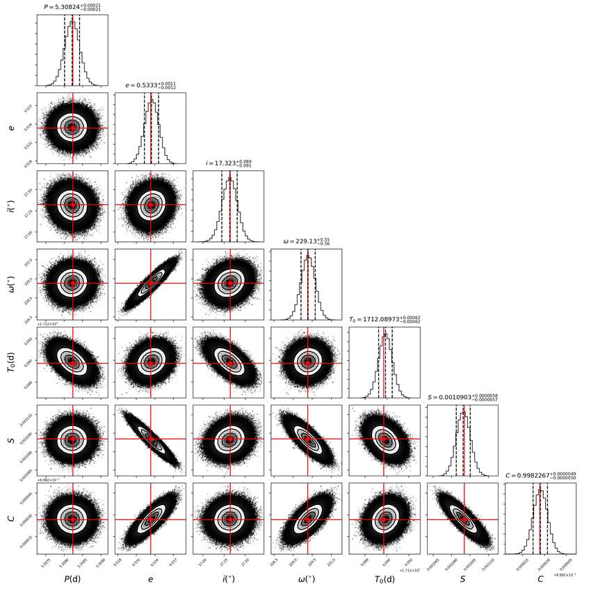
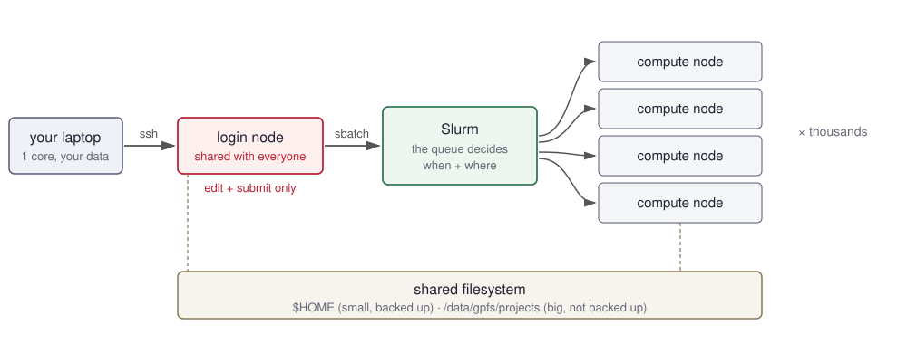
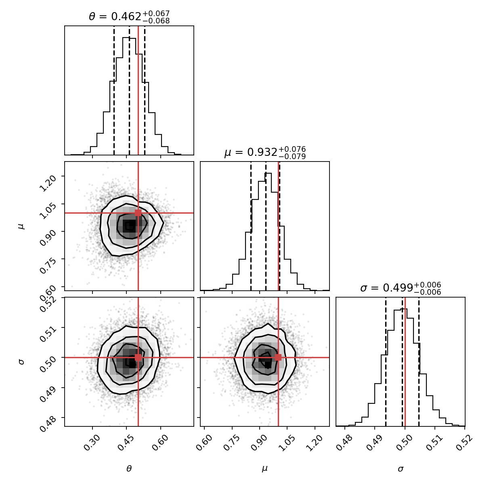
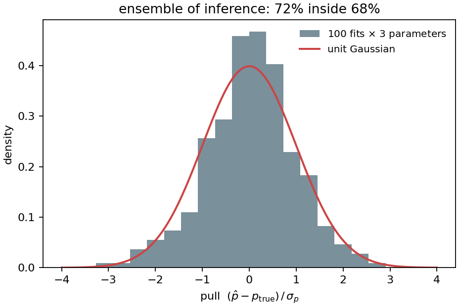
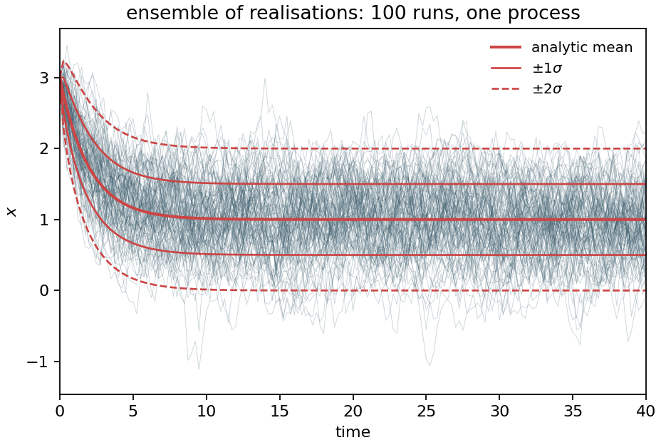
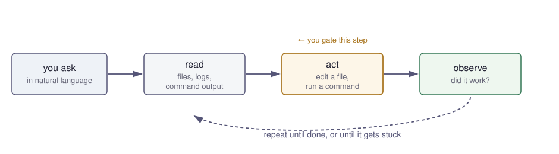
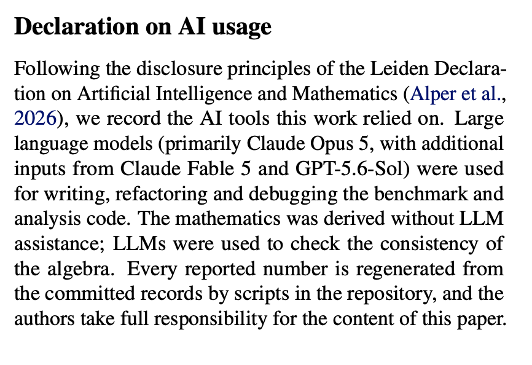

<!-- _class: lead titleslide -->

<div class="title-fig left">



</div>

<div class="title-fig right">


</div>

# From Supercomputers to AI Agents

## Modern workflows for high-performance computing

Tom Kimpson

MACSYS 101 series · September 2026

<span class="small">Follow along afterwards: `github.com/tomkimpson/macsys_101_hpc_and_ai_agents`</span>

---

# Two skills

<div class="cols">

<div>

### Part 1 — Slurm

How to run intensive computations on a remote machine


</div>

<div>

### Part 2 — AI agents

How to get an agent to write/debug your code


</div>

</div>

**We will be jumping back and forth between these slides and some live terminal demos** 

---

<!-- _class: divider -->

<div class="cols">

<div>

# Part 1 : HPC + slurm

</div>

<div>


</div>

</div>

---

# Why bother?

<div class="corner-fig">


</div>

Lots of science is now compute-intensive and/or scalable

<div class="cols">

<div>

### Bottlenecked by your laptop

- Your job needs 200 GB of RAM. Your laptop has 16.
- One run takes 6 hours. You need 10,000 runs.
- You closed the lid / it went to sleep / you needed to fly somewhere.
- Your "quick test" has been running since Tuesday and you can't use your machine.

</div>

<div>

### What you get instead

- Hundreds of independent runs at once — parameter sweeps, MCMC chains, bootstrap replicates, seeds
- Nodes with 100s of cores, TB of RAM, GPUs
- Jobs queue and run while you sleep; you get an email when they're done
- Reproducibility for free: the submission script *is* the record of what you ran

</div>

</div>

> HPC doesn't make your code faster. It lets you run a lot of it at once, on hardware you don't own, without babysitting it.

---

<!-- _class: tight -->

# What a cluster actually is




---

<!-- _class: tight -->

# How to get onto the cluster

<div class="cols">

<div>

### Before you can connect

- An account — request via your institution's HPC service desk
- Know your hostname: `spartan.hpc.unimelb.edu.au` (or whichever cluster)
- On/off campus? Some clusters require VPN from outside
- SSH key pair — generate once, upload the public half: `ssh-keygen -t ed25519`

</div>

<div>

### Connecting

- **`ssh`** — the baseline. `ssh user@host`
  - Set up `~/.ssh/config` (or alias) on day one so it's just `ssh spartan`
- **`mosh`** — ssh that survives suspend, wifi drops, and IP changes
  - Needs mosh installed on the cluster; not all sites allow it
- **`tmux`** — run *on* the cluster. Sessions persist after you disconnect
  - `tmux new -s work`, detach `Ctrl-b d`, come back `tmux a -t work`
- **VSCode Remote-SSH** — edit files as if local, integrated terminal
  - Caveat: runs a server on the login node, can be resource-hungry. Some sites discourage or block it

</div>

</div>


---

# How to run a job

You don't run your code directly. Instead you  **describe a job** and the scheduler (slurm = Simple Linux Unitility for Resource Management) decides when it runs.

Nothing runs on the login node 

<div class="cols">

<div>

### You tell the scheduler 

- How long it will take — `--time`
- How much memory — `--mem`
- How many cores — `--cpus-per-task`
- Which pool of nodes — `--partition`
- Who pays — `--account`

</div>

<div>

### What the scheduler does

- Allocates your job a place in the queue
- Packs small honest jobs in **sooner** than big greedy ones.
- Kills you at `--time`. 
- Kills you at `--mem`. 

</div>

</div>

> The queue is not first-come-first-served. It is an optimiser, and your resource
> request is your bid. **Ask for less, wait less.**

---

<!-- _class: tight -->

# How to describe a job

To run a job you have to write a shell script.
A job script is just a shell script. The `#SBATCH` lines are comments to the shell
and instructions to the scheduler.

```bash
#!/bin/bash
#SBATCH --job-name=ou                # what shows up in squeue
#SBATCH --account=punimXXXX          # who gets billed
#SBATCH --partition=cascade          # which pool of nodes
#SBATCH --time=00:05:00              # HH:MM:SS — a hard kill, not a hint
#SBATCH --ntasks=1                   # one process...
#SBATCH --cpus-per-task=1            # ...on one core
#SBATCH --mem=2G                     # for the whole job — also a hard kill
#SBATCH --output=logs/%x-%j.out      # %x = job name, %j = job id
#SBATCH --mail-type=END,FAIL         # tell me when it lands, or dies
#SBATCH --mail-user=you@unimelb.edu.au

set -euo pipefail                    # fail loudly, not silently

module purge                         # start from a known state
module load foss/2022a Python/3.10.4
source ~/venvs/macsys/bin/activate

srun python 01_mcmc.py --out posterior.png
```

---

<!-- _class: tight -->

# Basic driving skills

<div class="cols">

<div>

* `sinfo` to see what's available
* `sbatch` submits your job
* `sinteractive` for a shell on a compute node — debug there, never on the login node
* `squeue --me` to see your jobs, and why they're waiting
* `scancel $ID` to kill one
* `sacct -j $ID` for what happened to it — `squeue` forgets finished jobs
* `seff $ID` for how much you actually used

<br>

[Example job monitor from Swinburne](https://supercomputing.swin.edu.au/monitor/)

</div>

<div>

<span class="small"> e.g.`sbatch 01_run.sh` </span>




</div>

</div>


---

<!-- _class: tight -->

<!-- _class: tight -->

<!-- _class: figrow -->

# One job → one hundred

<div class="cols">

<div>

An **array job** is the same script run *N* times. 

```bash
#SBATCH --array=0-99%20     # 100 tasks, 20 at once

srun python 02_inference.py \
     --task-id ${SLURM_ARRAY_TASK_ID} \
     --out results/fit_${SLURM_ARRAY_TASK_ID}.npz
```

- `--time` and `--mem` are **per task**, not for the array.
- `%20` throttles you. An unthrottled 5,000-task array makes you unpopular!
- Each task writes its own file. 

```bash
sbatch 02_sweep.sh
squeue --me     
sbatch 02_collate.sh
```

<span class="small">Slurm can hold the collate job until the array finishes — see the appendix.</span>

</div>

<div class="rise">

<span class="small">**`02_sweep.sh`** — 100 MCMC fits</span>




<span class="small">**`03_sweep.sh`** — 100 forward simulations</span>




</div>

</div>

---

<!-- _class: tight -->

# Gotchas

| | The mistake | The fix |
|---|---|---|
| 1 | Running the real thing on the **login node** | `sinteractive` for debugging. That's what it's for. |
| 2 | `--time` too short → job killed at 99% | Time a short version first, then ask for ~1.5× |
| 3 | `--time`/`--mem` too *long* → queued for hours | `seff` after every job. Bring the numbers down. |
| 4 | Results written to `$HOME` | Small and backed up. Data goes in project storage. |
| 5 | Environment differs between login and compute | `module purge` first, then load explicitly, in the script |

<br>


---

<!-- _class: tight -->

# Cheat sheet 

<div class="cols">

<div>

**Getting on and getting oriented**
```bash
ssh spartan.hpc.unimelb.edu.au
module spider python        # search
module load foss/2022a Python/3.10.4
module list                 # what's loaded
sinfo -s                    # partitions, right now
```

**Submitting**
```bash
sbatch 01_run.sh
sbatch --parsable 02_sweep.sh       # id only
sbatch --dependency=afterok:$ID 02_collate.sh
sinteractive --time=1:00:00 --mem=8G
```

</div>

<div>

**Watching**
```bash
squeue --me
squeue --start -j $ID       # why am I waiting?
scontrol show job $ID
tail -f logs/ou-fit-$ID.out
```

**Afterwards**
```bash
seff $ID                    # did I size it right?
sacct -j $ID --format=JobID,State,Elapsed,MaxRSS,ReqMem
scancel $ID                 # one job
scancel ${ID}_7             # one array task
```

</div>

</div>

---

<!-- _class: divider -->

<div class="cols">

<div>

# Part 2 : AI agents

</div>

<div class="logos">

 

</div>

</div>


---

<!-- _class: tight -->

# How most people use AI already

<div class="cols3">

<div>

### 1. The chat window

ChatGPT / Claude / Gemini in a browser tab.

You paste in the traceback. It pastes back a fix. You paste that into your editor
and hope you copied all of it.

</div>

<div>

### 2. Tab-complete

Copilot's grey ghost text in VSCode.

It guesses the next line or two from what is above the cursor. You hit `Tab`.

</div>

<div>

### 3. Inline edit

Highlight a function, `Cmd-K`, *"vectorise this"*.

The same conversation as (1), but it can at least see the file you are in.

</div>

</div>


---

<!-- _class: tight -->

# AI agent

`model + tools + loop`




---


<!-- _class: tight -->

# The landscape

<div class="cols3">

<div>

<div class="logo">


</div>

### Claude Code

Anthropic. Terminal-first, also in the IDE.

</div>

<div>

<div class="logo">


</div>

### Codex

OpenAI. Terminal and cloud.

</div>

<div>

<div class="logo">


</div>

### Antigravity CLI

Google. Terminal only (?).

</div>

</div>

<br>

$+$ IDE-native agents (Cursor, Windsurf, Copilot agent mode) and open-source
harnesses (Aider, OpenHands) — though an open *harness* almost always still calls a
closed *model*. On how far the open-weight models actually trail:
[How far behind are open models?](https://www.lesswrong.com/posts/rJcCrXyEsJKmmDpWG/how-far-behind-are-open-models)


**The differences are real but small, and they move every few weeks.** 


---


<!-- _class: tight cmds -->

# Claude Code: basic driving skills

<div class="cols2">

<div>

### Starting out

| | |
|---|---|
| `/init` | Write a starter `CLAUDE.md` for the repo |
| `/memory` | Edit `CLAUDE.md` afterwards |
| `/permissions` | What it may run without asking |
| `/doctor` | Setup checkup; also trims a bloated `CLAUDE.md` |

### Steering a task

| | |
|---|---|
| `/plan` | Plan first, act second. Use before anything large |
| `/diff` | What has it actually changed? |
| `/rewind` | Roll code and conversation back to a checkpoint |

### Context is the state

| | |
|---|---|
| `/context` | What is filling the window |
| `/compact` | Summarise to free space, same conversation |
| `/clear` | New conversation, empty context |

</div>

<div>

### Before you ship

| | |
|---|---|
| `/simplify` | Cleanup pass on what it just wrote: duplication, nesting, naming. Claims to preserve behaviour &mdash; so only run it with tests in place |
| `/code-review` | Reviews the diff for correctness bugs. `--fix` applies the findings |
| `/batch`; | Decomposes a codebase-wide change into 5&ndash;30 units, one background agent per unit, each in its own git worktree, each opening a PR |

### Worth knowing about

`/model` `/effort` &middot; `/usage` (cost) &middot; `/resume` &middot;
`/mcp` &middot; `/btw` (side question, off the record)

<br>


</div>

</div>


---

demo
1. Lets fix this bug...
2. Lets soup-up our MCMC to use JAX, Hamiltonain Monte Carlo with autodiff, and create a visualisation


---

<!-- _class: tight -->

# Opinions / tips <span class="small">(1/2)</span>

<div class="cols">

<div>

### How to drive it

- **Research is not vibe-coding an app.** The litmus test: *would you recognise a wrong answer?* 
- **Good software engineering matters more, not less.** Branches, PRs, small commits, unit tests, etc.
- **Keep asks small; `/clear` often.** Hallucinations, unwanted changes, weakened tests and mostly context problems.
- **Parallel agents/tabs work, but easy to lose track.** Start with one.
- **Bio work often banned from using top models** !!!

</div>

<div>

### Stuff to definitely delegate

- Plotting and figure iteration
- File I/O, format wrangling, data munging
- Test scaffolds around code you already trust
- Mechanical refactors, porting between languages
- Reading an unfamiliar codebase &mdash; ask before you edit


</div>

</div>

---

<!-- _class: tight -->

# Opinions / tips <span class="small">(2/2)</span>

<div class="cols">

<div>

### Say that you used it

- **Don't hide it.** Say what you used. Everyone else is using it too!
- **Record which models, and for what**: writing, code, algebra, the maths itself.
- **Say what *you* checked**, and take responsibility for the content.
- **Make every number regenerable.** If each figure and table comes out of a script in the repo, the disclosure writes itself.

<span class="small">The **Leiden Declaration on AI and Mathematics** (June 2026, endorsed by the IMU) reccomends a disclosure section
[leidendeclaration.ai](https://leidendeclaration.ai)</span>

</div>

<div>



<br>

> With great power comes great responsibility! **You** are ultimately responsible for the work.

</div>

</div>

---

<!-- _class: tight -->

# What it costs


| US\$ / month | Claude | Codex (OpenAI) | Antigravity (Google) |
|---|---|---|---|
| Free | 0 &mdash; *no* Claude Code | 0 &mdash; limited | 0 &mdash; limited |
| Entry | "Pro" **$20** | "Plus" **$20** | "AI Pro" **$20** |
| Heavy &mdash; 5&times; / 20&times; | "Max" **$100** / **$200** | "Pro" **$100** / **$200** | "AI Ultra" **$100** / **$200** |

<br>
<div class="cols">

<div class="small">

**Subscription** &mdash; flat rate, metered by a rolling **5-hour** window *and* a **weekly** cap. 

</div>

<div class="small">

**API key** &mdash; per token, no ceiling. Opus 5 is ~**$5 / $25** per million tokens in / out. 

</div>

</div>

**For a group:** 
* **Claude Team**, 5x Max, $25 / user. 
* **Claude Team for Scientists**, 5x Max, $15/user. See [anthropic.com/news/expanding-support-for-scientists](https://www.anthropic.com/news/expanding-support-for-scientists)
* UoM - see Kate for a licence
* Others - as PI to look at Claude Team for Scientists

Consider budgeting for AI usage on any grant applications. 


---

<!-- _class: tight -->

# Take-homes

<div class="cols">

<div>

### Slurm

- **Don't run intensive compute on your laptop** 
- **Nothing runs on the login node.**
- **HPC doesn't necessarily make your code faster**. 
- **Your resource request is a bid.** Ask for less, wait less.
- **Try to judge memory/time reqs. accurately**
- **The submission script is the record** of what you ran.

</div>

<div>

### Agents

- **`model + tools + loop`** — not a chat window. It reads, runs, and checks its own work.
- **Delegate the mechanical stuff** — plots, I/O, refactors, reading unfamiliar code.
- **The litmus test: would you recognise a wrong answer?** If not, don't delegate it.
- **Context is the state.** Small asks, `/clear` often.
- **Say that you used it.** You own the result either way.

</div>

</div>


---

<!-- _class: lead -->

# Thanks

This talk + scripts can be found at

## `github.com/tomkimpson/macsys_101_hpc_and_ai_agents`

<span class="small">


Spartan docs: [dashboard.hpc.unimelb.edu.au](https://dashboard.hpc.unimelb.edu.au) ·
Slurm docs: [slurm.schedmd.com](https://slurm.schedmd.com/documentation.html) ·
Claude Code: [docs.claude.com/claude-code](https://docs.claude.com/en/docs/claude-code)

</span>

---

<!-- _class: lead -->

# Appendix


---

<!-- _class: tight -->

# Chaining jobs with `--dependency` <span class="tag">appendix</span>

Submit the whole pipeline at once and walk away. Slurm holds each stage until the
one before it is done — useful when the array will sit in the queue for six hours.

```bash
ARRAY=$(sbatch --parsable 02_sweep.sh)          # --parsable prints just "12345679"
sbatch --dependency=afterok:$ARRAY 02_collate.sh
```

Plain `sbatch` prints `Submitted batch job 12345679`; `--parsable` prints the bare id
so you can capture it. The collate job queues *immediately*, sits at `PD ... (Dependency)`,
and starts by itself when the last task exits cleanly.

<div class="cols">

<div class="small">

| flavour | starts when the array... |
|---|---|
| `afterok:$ID` | finished, and **every** task succeeded |
| `afterany:$ID` | finished, pass or fail |
| `afternotok:$ID` | failed — for cleanup and alerts |
| `aftercorr:$ID` | task *i* waits for task *i*, one-to-one |
| `singleton` | (one job of this name at a time) |

</div>

<div class="small">

**The trap.** With `afterok`, one failed task means the dependent job *never runs*.
It does not error — it sits at `Reason=(DependencyNeverSatisfied)` until you
`scancel` it. Some sites clear it via `kill_invalid_depend`; many do not.

So: `afterok` when a partial result is worthless, `afterany` when your collator can
cope with missing files.

</div>

</div>

---

<!-- _class: tight -->

# FAQs <span class="tag">appendix</span>

**Why `srun python ...` and not just `python ...`?**
`sbatch` allocates resources; `srun` launches a *step* inside that allocation. For a
single-core job it barely matters, but it gets you per-step accounting in `sacct`, and
it is what you need the moment you go multi-node. Harmless habit, useful later.

**`--ntasks` vs `--cpus-per-task`?**
`--ntasks` = how many separate processes (MPI ranks). `--cpus-per-task` = how many cores
each one gets (threads, OpenMP). One process on 8 threads is `--ntasks=1
--cpus-per-task=8`. Eight MPI ranks is `--ntasks=8 --cpus-per-task=1`. Most of the time
you want neither — you want an array of 100 single-core jobs.

**What about GPUs?**
`--partition=gpu-a100 --gres=gpu:1`. Everything else is the same. The hard part is never
Slurm; it is whether your code uses the GPU.

**What if a few array tasks fail?**
`sacct -j $ARRAYID --state=FAILED` lists them, and `sbatch --array=7,23,88 02_sweep.sh`
reruns just those. This is why one file per task matters.

---

<!-- _class: tight -->

# Running an agent *on* the cluster <span class="tag">appendix</span>

You can install and run Claude Code on a login node, which makes the debugging loop
tighter — it reads the logs and resubmits without anything round-tripping to your laptop.

Two caveats worth knowing before you do:

- **It is a shared login node.** Agents run commands. Everything on the etiquette slide
  applies double, and `CLAUDE.md` should say so explicitly.
- **Check your site's policy on outbound API calls** and on what may leave the cluster.
  If your data is sensitive, the agent reading your files is a data-governance question,
  not just a technical one.


